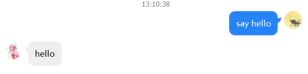

# Terminal Service

通过命令行来操控你的QQ机器人

## Usage

### 准备

1. 你刚好有一个装上了[CQHTTP](https://cqhttp.cc/)插件的[Coolq](https://cqp.cc/)机器人
2. 创建一个SpringBoot web工程
3. 引入本项目依赖(目前只能clone源码，再maven install到本地使用)
4. 添加配置项`bot.cq-http-url`，默认值是`http://localhost:5700`

### 开始

使用注解`@CommandLine.Command`创建一个命令，更多细节请看[picocli](https://github.com/remkop/picocli)

```java
@CommandLine.Command
public class SomeCommand{
	// 一些命令参数...
}
```

使用注解`@CommandController`创建一个命令处理器，需要实现`Reply`接口或`Send`接口

```java
@CommandController(bind = "xxx")
public class SomeCommandController implements Reply {

    private SomeCommand command;

    @Override
    public ReplyEntity call(PostEntity postEntity) { // Coolq上报的消息作为参数传进来
        // 实现这个接口时，返回的内容将会作为快速回复发送出去
        // do something with your command...
    }
}
```

```java
@CommandController(bind = "xxx")
public class SomeCommandController implements Send {

    private SomeCommand command;

    @Override
    public void call(CQClientApi cqClientApi, PostEntity postEntity) {
       // 实现这个接口时，可使用传入的api进行发送消息等操作
       // // do something with your command...
    }
}
```

关于`CQClientApi`，这个api描述了一些CQHTTP支持的操作，在没有自定义实现并加入Spring容器管理时，我提供了一个依赖于我[另一个项目](https://github.com/VWmin/rest-proxy)的实现。

## Example

我要使用的命令

```java
@CommandLine.Command(name = "say")
public class SayCommand {

    @CommandLine.Parameters(index = "0")
    private String saySomething; // 位于say后面的第一个单词，如say hello中就是hello

    public String getSaySomething() {
        return saySomething;
    }

}
```

我如何处理这个命令

```java
@CommandController(bind = "say")
public class SayCommandController implements Reply {

    private SayCommand command;

    @Override
    public ReplyEntity call(PostEntity postEntity) {
        return new ReplyEntity(
                new MessageSegmentBuilder()
                        .addTextSegment(command.getSaySomething()) // 简单地将say后面的内容重复一遍
                        .build()
        );
    }
}
```

启动，并试一下



ok